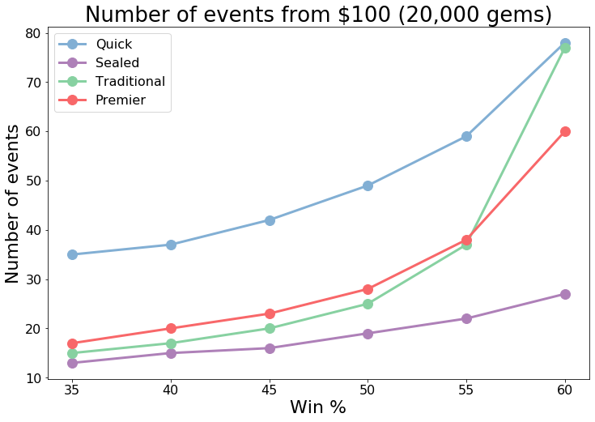
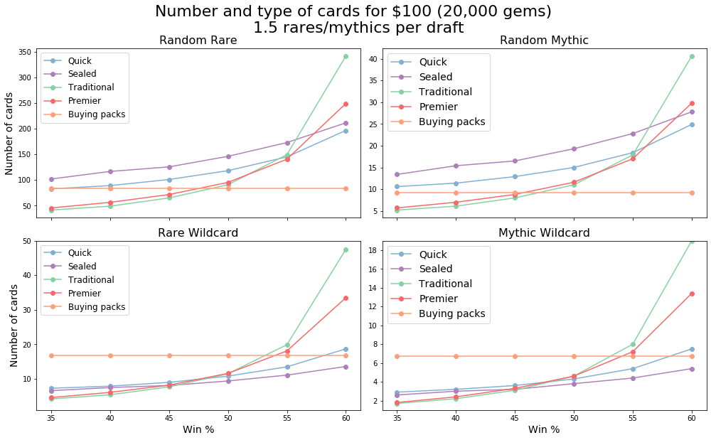
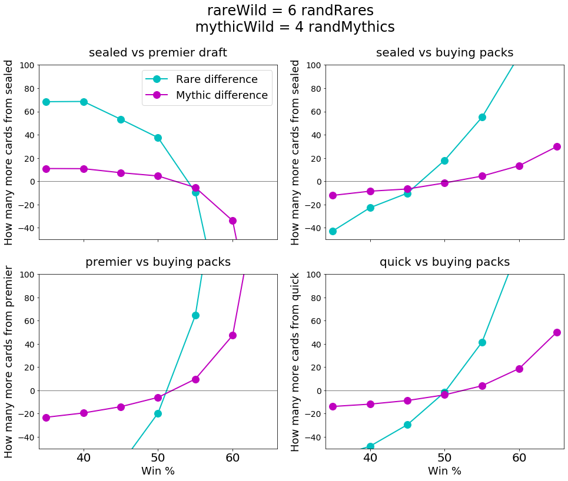
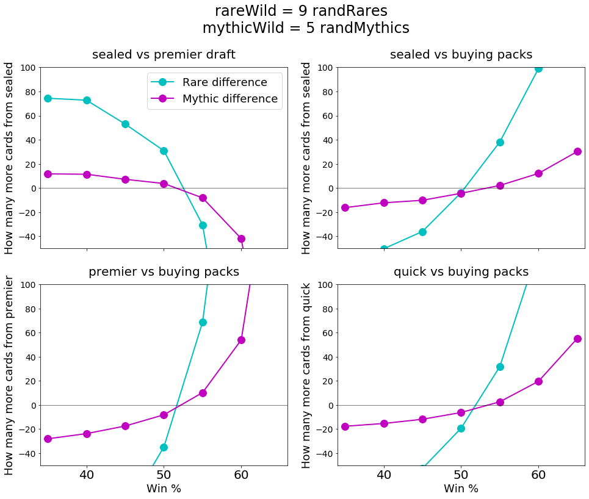
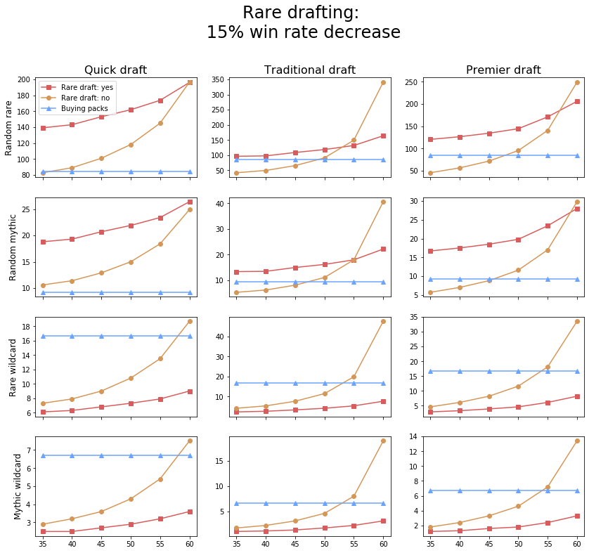
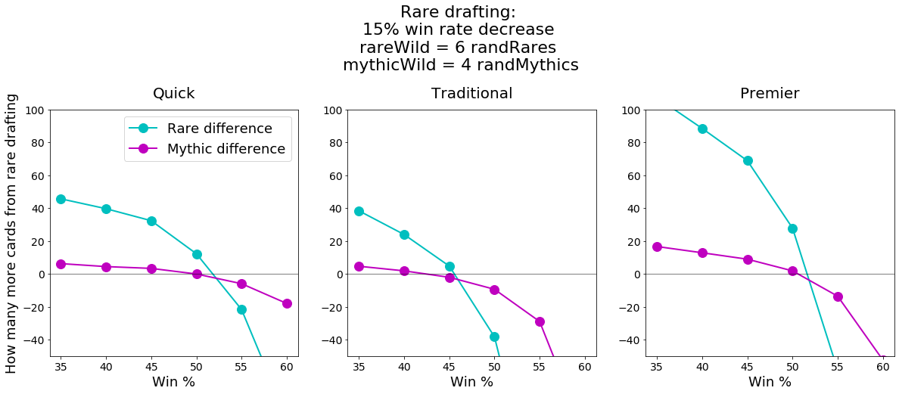
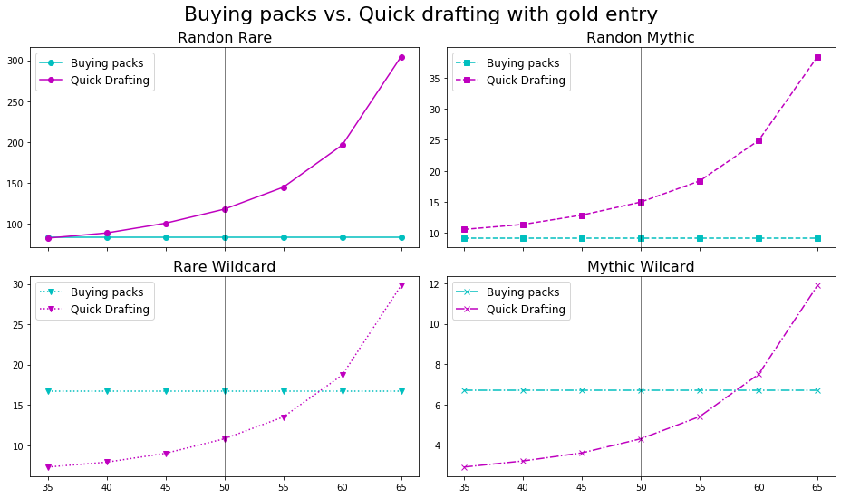
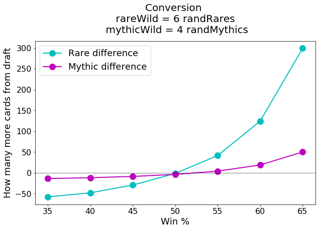

# 
 Magic Arena Economy Analysis 

<b>Note:</b> Many previous analyses use the average rewards (in gems or gold) per event as the primary outcome. This approach has some limitations. The following analysis: 1. Starts from X amount of money/gems. 2. Takes the gems you win from an event and inputs them into more events until you don't have enough gems to play again. 3. Accounts for the fact that quick draft entry is half the price of other draft formats.

# 
 1. How many events can you play per amount of money invested

>## Quick draft clearly beats the other event types. What happens above a 60% win rate?

>## Traditional draft takes off quickly once your win rate inches above 60%. Note that this analysis indirectly tells you how many gems you win relative to the cost of entry (expected value).

# 
 3. What is the best limited event if you're mainly concerned with growing your collection for constructed 

>## One important parameter for this analysis is how many rares/mythics you get on average per draft. Let's first consider the case where you don't rare draft at all. You only take a rare/mythic that's naturally fits your deck. Based on feedback from Reddit users, let's assume that the AVERAGE number is 1.5 rares/mythics per draft.

>## At 50% and below, it is clear that Sealed and Quick Draft are preferable to Premier and Tradition. But above 50% it is hard to interpret because Quick Draft and Sealed result in more random rares/mythics, but less wildcards than Premier and Limited.There's also the fact that just using your gems to buy packs results in more rare and mythic wilcards at 50% but less random rare/mythics.

>## To account for this we can decide how many random rare/mythics are worth one wildcard rare/mythic, and then compare.  

>## Later in the season once you start getting duplicates, wildcards will be more valuable. Let's change the conversion rate so that wildcards are more valuable.

>## Buying packs is surprisingly good at 50% and below.

# 
 3. Rare drafting 

>## Above, we assumed you were trying to build the best deck and getting 1.5 rares/mythics per draft. What happens when we disregard the quality of our draft deck and pick every rare/mythic that we see?

>## There are two main parameters for this analysis: 1. How many more rares/mythics you get per draft when rare drafting. 2. How much your win rate decreases.   This is tricky because rares and mythics are more commonly passed in some formats than others. Luckily MTGGoldfish just published these numbers (https://www.mtggoldfish.com/articles/collecting-mtg-arena-ikoria-edition):  Quick Draft - you see 3.66 Rares and 0.42 Mythics per draft  Premier Draft - you see 6.7 Rares and 0.47 Mythics per draft  Traditional Draft - you see 7.6 Rares and 0.60 Mythics per draft

<b>Note:</b> Below, a win rate of 50% is your win rate when not rare drafting (purple line). If rare drafting decreases your win rate by 5%, the blue lines at 50% would be the rewards at 50% - 5% (i.e., 45%).

<b>Note:</b> To use this graph correctly, use your win rate when NOT rare drafting; the graph corrects for you.

>## This is a ridiculous wall of information. Let's reduce it with our conversion method above.

# 
 4. Should I spend my surplus gold directly on buying packs, or get cards indirectly by entering limited events with the marked up gold entry fee? 

# 
 Thanks for reading. Please provide suggestions and corrections. 

