# 
 Magic Arena Economy Analysis 

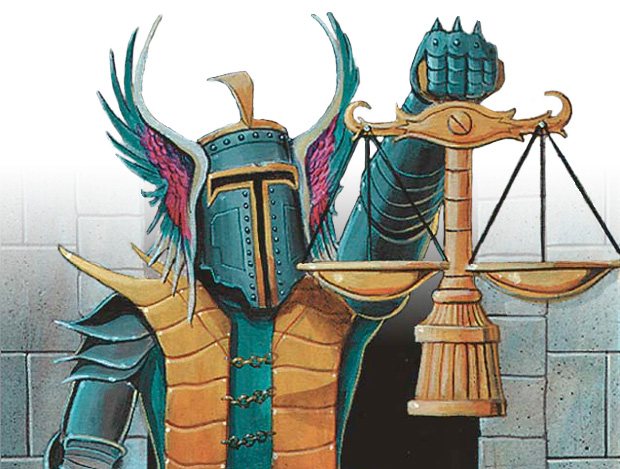

<b>Note:</b> Many previous analyses use the average rewards (in gems or gold) per event as the primary outcome. This approach has some limitations. The following analysis: 1. Starts from X amount of money/gems. 2. Takes the gems you win from an event and inputs them into more events until you don't have enough gems to play again. 3. Accounts for the fact that quick draft entry is half the price of other draft formats.

# 
 1. How many events can you play per amount of money invested

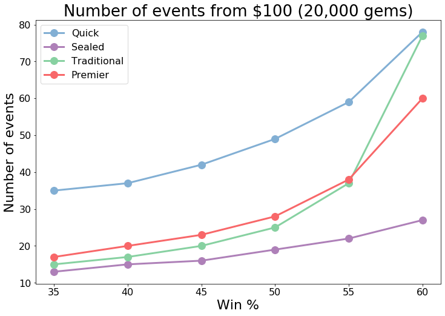

>## Quick draft clearly beats the other event types. What happens above a 60% win rate?

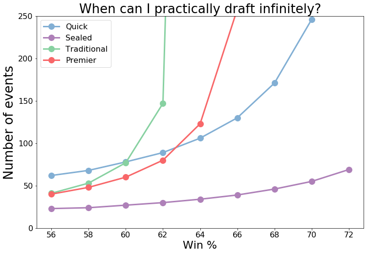

>## Traditional draft takes off quickly once your win rate inches above 60%. Note that this analysis indirectly tells you how many gems you win relative to the cost of entry (expected value).

# 
 3. What is the best limited event if you're mainly concerned with growing your collection for constructed 

>## One important parameter for this analysis is how many rares/mythics you get on average per draft. For now, I'll assume you aren't rare drafting. Let's assume 3 rares/mythics per draft.

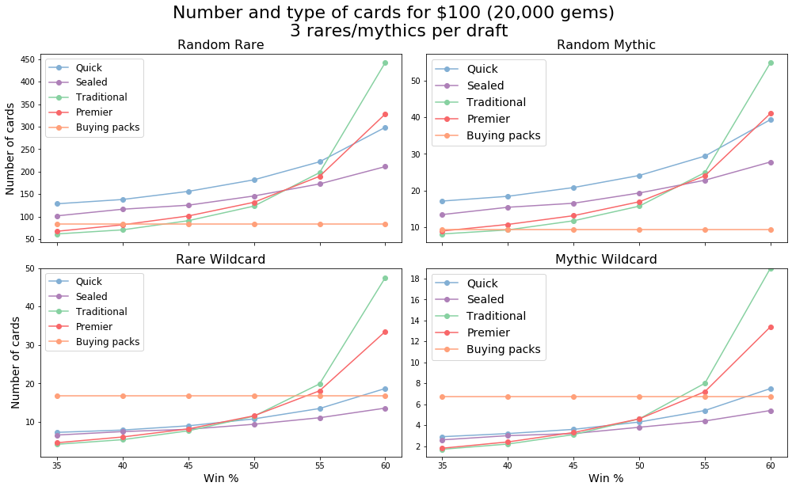

>## Quick draft results in the most random rares and mythics for win rates of 55% and below. But what about the fact that just using your gems to buy packs results in more rare and mythic wilcards at 50% and that premier and traditional draft results in more wildcards at 55% and above?

>## To account for this we can decide how many random rare/mythics are worth one wildcard rare/mythic, and then compare.

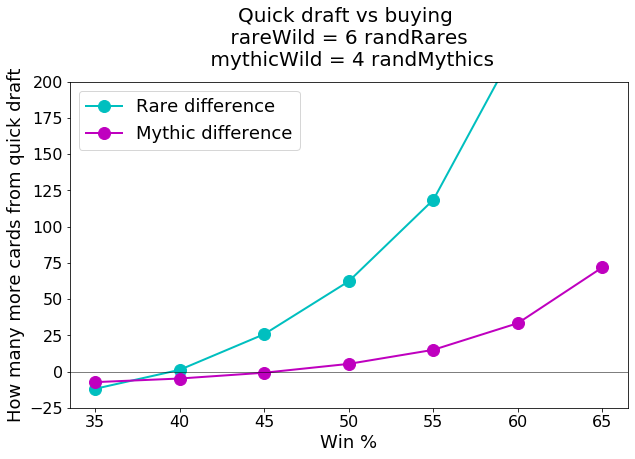

>## You can see that when assuming that a rare wildcard is equal to 6 random rares and that a mythic wildcard is equal to 4 mythic wildcards, quick draft is the better option compared to buying packs directly

>## What about quick draft compared to traditional and premier at 55% and above?

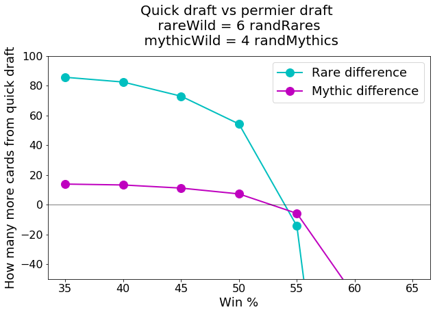

>## You're slightly ahead in premier draft at 55%. Because traditional results in more cards than premier (see earlier graph), we know that you'll also be better off in traditional than quick draft as well.

>## However, I think my assumption above that you get an average of 3 rares/wildcards per draft is too high. In my experience the AVERAGE is maybe around 1 (often 0; often 2; when you're lucky 3). Let's rerun the analysis at 1 instead of 3.

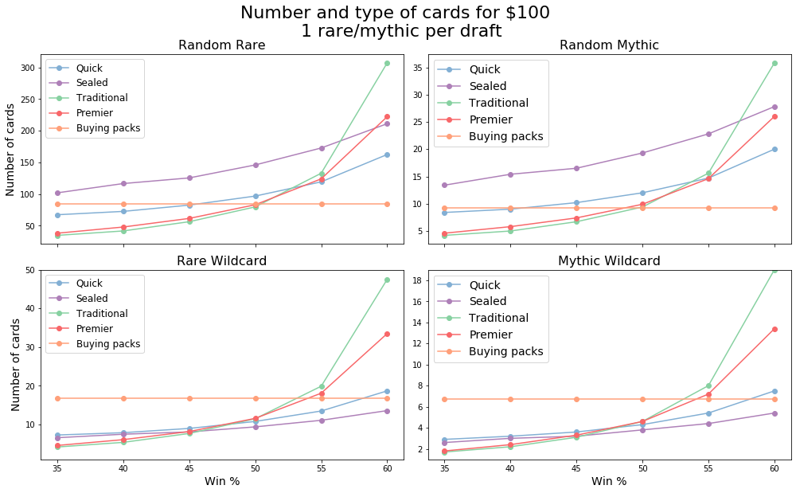

>## You can see that changing from 3 to 1 rare/mythic per draft does two things: 1. Sealed beats quick draft and the other draft formats at 50% and below. 2. Quick draft is penalized more than traditional and premier.

>## Let's use the conversion above to compare sealed to buying packs.

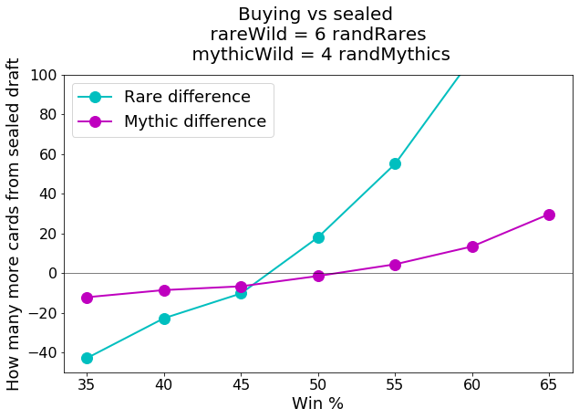

>## Sealed comes out ahead at 50% and greater, but not by as much as you might have expected.

>## Lets change the converstion so that a rare wildcard is worth 8 random rares (say you really just want to craft a specific deck quickly)

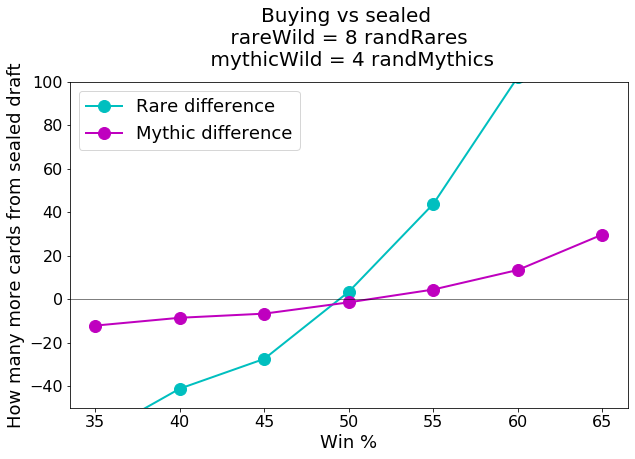

>## In this case, buying packs gives you the same value in cards.

# 
 3. Rare drafting 

>## Above, we saw that the number of rares/mythics per draft matters a lot. What happens when we disregard the quality of our draft deck and pick every rare/mythic that we see?

>## There are two main parameters for this analysis: 1. How many more rares/mythics you get per draft when rare drafting. 2. How much your win rate decreases.  For the first round, I'll assume you get 1 when not rare drafting and 5 when rare drafting, and that your win rate only decreases 5%.

<b>Note:</b> Below, a win rate of 50% is your win rate when not rare drafting (purple line). If rare drafting decreases your win rate by 5%, the blue lines at 50% would be the rewards at 50% - 5% (i.e., 45%).

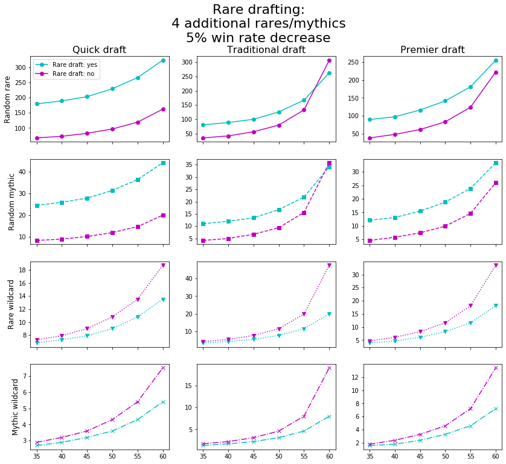

>## The value of rare drafting depends on the draft format. You gain a ton from rare drafting in quick draft regardless of how good you are when not rare drafting. The other formats are hard to discern at 55%.

>## Before you read too much into the results above, I think the above assumptions don't penalize you enough for rare drafting. Let's now say that you get 1 rare/mythic when not rare drafting, 6 when rare drafting, and that your win rate decreases 10% (which is the lowest win rate that would be noticeable in a single draft event)

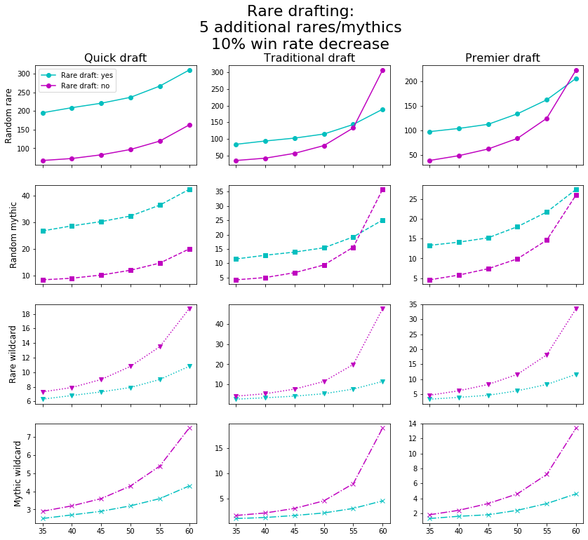

>## It seems that it's hard to go wrong rare drafting in quick draft. It's also clear that it's a disaster to rare draft in other formats if you're at or above 60%.

>## To be thorough let's do one more, where you get 1 rare/mythic when not rare drafting, 5 when rare drafting, and your win rate drops 25%, which may be closer to the truth in a competitive format like traditional.

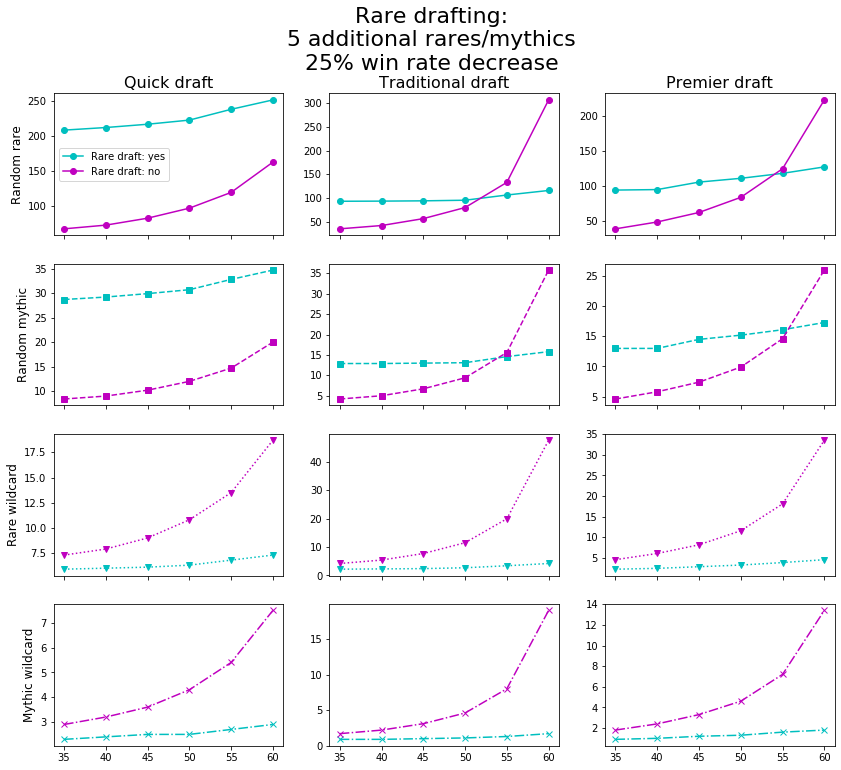

>## Even if you can manage a 60% win rate in quick draft when not rare drafting, you still come out very ahead if you drop to a 35% win rate when rare drafting. But if you're that good you should probably be trying to maintain a high win rate in traditional and not rare drafting.

# 
 4. Should I spend my surplus gold directly on buying packs, or get cards indirectly by entering limited events with the marked up gold entry fee? 

>## Given the results so far, and assuming you have a roughly average win rate, we should compare buying packs to quick draft when rare drafting.

>## But for competitive people like myself who can't allow themselves to rare draft, let's assume you aren't rare drafting and that you get 1 rare/mythic per draft.

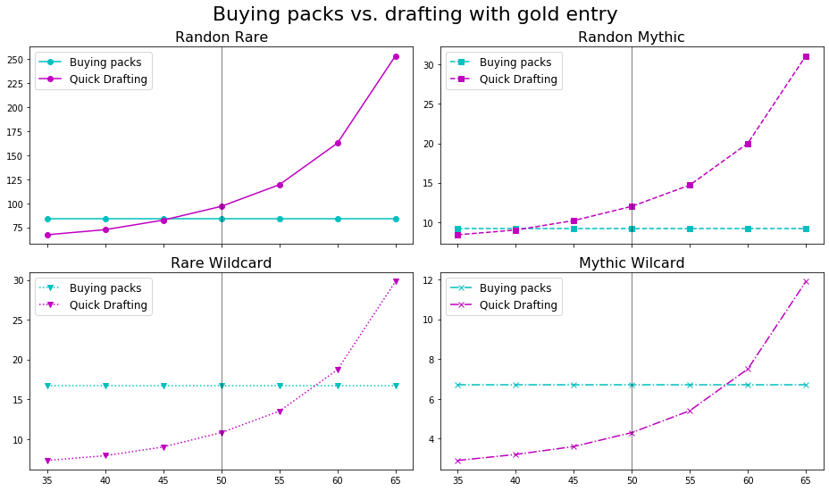

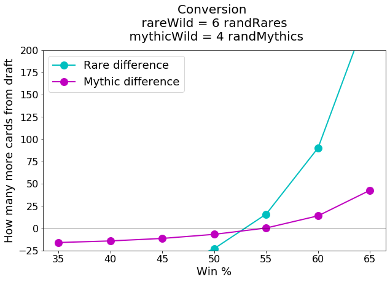

>## You're worse off drafting at 50%. Let's say you get 2 rare/mythics per draft instead. Let's also remove the first set of graphs and just look at the conversion graph.

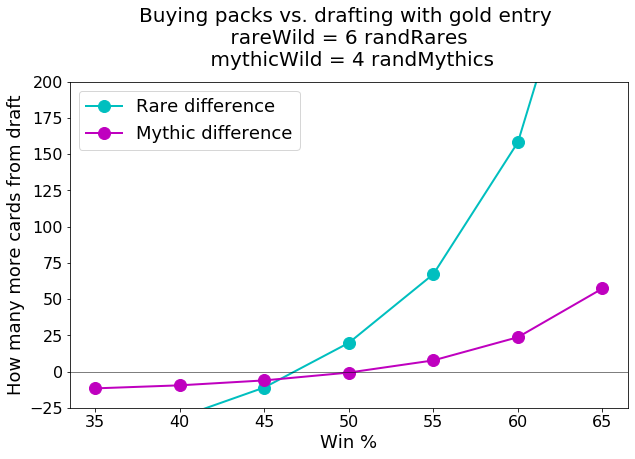

>## With the additional 1 rare/mythic you come out slightly ahead drafting.

>## What about when rare drafting in quick draft, which is what you should be doing if you're primary interested in growing your collection and are fine with losses. Let's say 5 rare/mythics when rare drafting, and a 25% decrease in win rate to be extreme and test the limit.

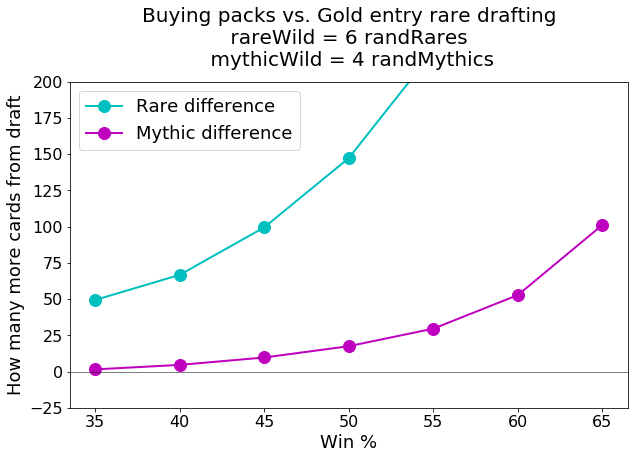

<b>Note:</b> To use this graph correctly, use your win rate when NOT rare drafting; the graph corrects for you.

>## Apparently you should take that gold and snag every rare you see with reckless abandon, regardles of the loss of dignity that comes with losing.

# 
 Thanks for reading. Please provide suggestions and corrections. 

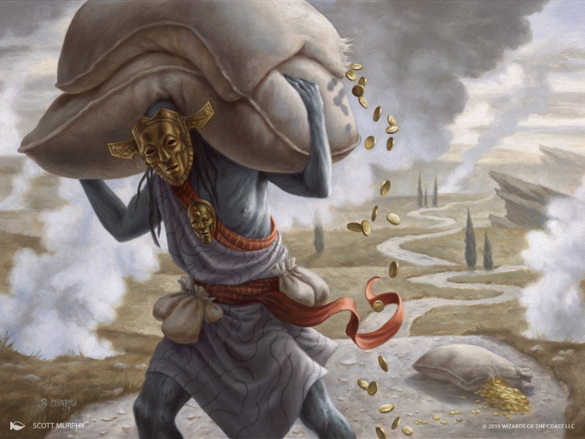
